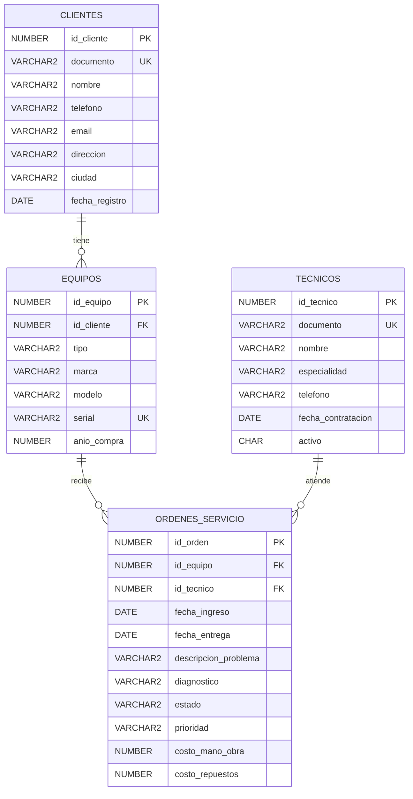

# Sistema de gestion de ordenes de servicio tecnico (TecniServ) 

Aplicación de base de datos para un taller de reparación de equipos electrónicos. Permite registrar clientes, técnicos, equipos y el ciclo completo de las órdenes de servicio (desde su recepción hasta la entrega), incluyendo el manejo de costos y reportes operativos. 

El sistema integra los componentes vistos durante el curso: modelado relacional, DDL/DML en Oracle SQL, restricciones de integridad y una aplicación web en Streamlit con lectura y escritura sobre la base de datos. 

## 1. Integrantes del grupo: 

* Sarah Sofia Leon 
* Aguamarina Strauss 

 

## 2. Dominio Elegido 

Elegimos un taller de servicio técnico porque cualquier persona podría visitar un taller real para validar el modelo. Las entidades son claras (cliente, equipo, técnico, orden) pero las relaciones son diversas: por ejemplo, un cliente puede traer varios equipos, un equipo puede tener varias órdenes a lo largo de su vida útil, y cada orden involucra un técnico. 

Tambien tiene reglas de negocio interesantes para modelar con restricciones: estados del flujo, prioridades, costos que no pueden ser negativos, fechas de entrega posteriores a las de ingreso, asi como las vistas en clase 

Y finalmente, justifica fácilmente operaciones CRUD desde la aplicación: registrar clientes nuevos, dar de alta equipos, abrir órdenes, actualizar el estado conforme avanza la reparación. 

 

## 3. Diagrama Entidad-Relacion 



## 4. Descripcion de las tablas 

### I. Clientes

| Columna        | Tipo          | Restricción               | Justificación                                                       |
| -------------- | ------------- | ------------------------- | ------------------------------------------------------------------- |
| id_cliente     | NUMBER(10)    | PK                        | Identificador sintético generado por secuencia.                     |
| documento      | VARCHAR2(20)  | UQ, NOT NULL              | Cédula o NIT: identifica legalmente al cliente; no puede repetirse. |
| nombre         | VARCHAR2(100) | NOT NULL, CHECK           | Sin nombre no se puede facturar.                                    |
| email          | VARCHAR2(100) | CHECK (formato `_@_._`)   | Validación básica de email para evitar basura.                      |
| ciudad         | VARCHAR2(60)  | NOT NULL, DEFAULT 'cali'  | Útil para reportes geográficos.                                     |
| fecha_registro | DATE          | NOT NULL, DEFAULT SYSDATE | Histórico de antigüedad.                                            |

---

### II. TECNICOS

| Columna      | Tipo         | Restricción                              | Justificación                                                              |
| ------------ | ------------ | ---------------------------------------- | -------------------------------------------------------------------------- |
| id_tecnico   | NUMBER(10)   | PK                                       | Identificador único del técnico.                                           |
| documento    | VARCHAR2(20) | UQ, NOT NULL                             | Cada técnico es una persona única.                                         |
| especialidad | VARCHAR2(20) | CHECK (HARDWARE, SOFTWARE, REDES, MIXTO) | Permite asignar órdenes según la competencia.                              |
| activo       | CHAR(1)      | CHECK (S, N)                             | Soft-delete: no eliminamos técnicos con historial; los marcamos inactivos. |

---

### III. ORDENES_SERVICIO

| Columna         | Tipo         | Restricción               | Justificación                                                          |
| --------------- | ------------ | ------------------------- | ---------------------------------------------------------------------- |
| id_orden        | NUMBER(10)   | PK                        | Identificador único de la orden.                                       |
| id_equipo       | NUMBER(10)   | FK (EQUIPOS)              | Sin CASCADE: una orden histórica no debe perderse al borrar el equipo. |
| id_tecnico      | NUMBER(10)   | FK (TECNICOS)             | Protege el histórico de órdenes realizadas.                            |
| estado          | VARCHAR2(20) | CHECK (6 valores)         | Modela el flujo del servicio.                                          |
| prioridad       | VARCHAR2(10) | CHECK (BAJA, MEDIA, ALTA) | Permite ordenar la cola de trabajo.                                    |
| costo_mano_obra | NUMBER(10,2) | CHECK (>= 0)              | Los costos no pueden ser negativos.                                    |
| costo_repuestos | NUMBER(10,2) | CHECK (>= 0)              | Los costos no pueden ser negativos.                                    |
| fecha_entrega   | DATE         | CHECK (>= fecha_ingreso)  | No se puede entregar antes de recibir.                                 |

---

# 5. REGLAS DE NEGOCIO

| Regla                                                         | Implementación                            |
| ------------------------------------------------------------- | ----------------------------------------- |
| Cada cliente debe tener un documento único                    | `UNIQUE(documento)` en CLIENTES           |
| El email, si se proporciona, debe tener un formato válido     | `CHECK email LIKE '%_@_%._%'`             |
| Las especialidades de los técnicos son un catálogo cerrado    | `CHECK especialidad IN (...)`             |
| Un técnico inactivo se conserva, no se elimina                | Columna `activo CHAR(1)` con `CHECK`      |
| Si se borra un cliente, sus equipos también se borran         | `FK ON DELETE CASCADE`                    |
| No se puede borrar un equipo o técnico con órdenes históricas | FK por defecto (`RESTRICT`)               |
| El estado de una orden sigue un flujo definido                | `CHECK estado IN (...)`                   |
| Los costos son siempre >= 0                                   | `CHECK costo_* >= 0`                      |
| La fecha de entrega no puede ser anterior a la de ingreso     | `CHECK fecha_entrega >= fecha_ingreso`    |
| El año de compra del equipo es realista                       | `CHECK anio_compra BETWEEN 1990 AND 2100` |


# 6. Estructura del repositorio 

```
proyecto-final-bi/ 
├── README.md               ← este informe 
├── requirements.txt        ← dependencias Python 
├── .env.example            ← plantilla de variables de entorno 
├── .gitignore 
├── docs/ 
│   └── erd.svg             ← Diagrama ERD 
├── scripts/ 
│   ├── ddl.sql             ← CREATE TABLE + restricciones + secuencias + índices 
│   └── dml.sql             ← INSERT con datos de prueba (8 clientes, 5 técnicos, 
│                              10 equipos, 12 órdenes) 
└── app/ 
    ├── app.py              ← Aplicación Streamlit (Dashboard + 4 secciones) 
    └── connection.py       ← Módulo de conexión a Oracle (thick/thin, wallet) 
```

# 7. Instrucciones para ejecutar app: 

### a. Requisitos previos
* Python 3.10+ 
* Oracle Instant Client instalado descarga: 
 ```
 https://www.oracle.com/database/technologies/instant-client.html
 ```
* Una base Oracle accesible (Oracle Cloud Autonomous Database, XE local o cualquier instancia) 

### b. Clonar y preparar entorno 
 ```
git clone https://github.com/dxnjipo/Proyecto-Final-BI.git
 ```
  ```
 cd proyecto-final-bi 
  ```
### Entorno virtual 
```
python -m venv venv 
```
### Activar:
### Windows:  
```
venv\Scripts\activate 
```
###  Linux/Mac:
```
source venv/bin/activate
```
```
pip install -r requirements.txt 
```
### c. Configurar credenciales: 
```
cp .env
```
Edita .env y completa ORACLE_USER, ORACLE_PASSWORD y ORACLE_DSN 
### Para oracle cloud autonomous database: 
* 1. Descarga el Wallet desde la consola de OCI (botón DB Connection → Download Wallet). 
* 2. Descomprímelo en una carpeta (ej. ./wallet).  
* 3. En el .env configura ORACLE_WALLET_DIR=./wallet y un DSN como tecniserv_high. 

### D. Crear tablas y cargar datos
* I.  Conéctate a tu base con SQL Developer, SQLcl o sqlplus y ejecuta:
```
@scripts/ddl.sql 
@scripts/dml.sql 
```

Los scripts son idempotentes: hacen DROP + CREATE + INSERT y se pueden re-ejecutar sin errores.  

### E. Verificar conexion: 
 ```
 python app/connection.py 
 ```
 * Esperado: 
 * Probando conexión a Oracle... 
 * ✓ Conexión exitosa 

### F. Lanzar app:  
```
streamlit run app/app.py 
```

# 8. Reflexion del equipo: 
* a. Configuración de Oracle Cloud: descargar el wallet y configurar el modo thick del cliente oracledb nos tomó tiempo. La primera conexión falló porque no teníamos el Instant Client en la variable PATH. Lo resolvimos documentándolo claramente en el .env.example y en este README.  

* b. Modelado de las restricciones: al inicio pusimos CHECK por costumbre, pero al revisarlas notamos que algunas no tenían sentido de negocio (ej. limitar el teléfono a 10 dígitos exactos cuando hoy hay números internacionales). Aprendimos a justificar cada restricción por la regla del negocio, no solo por cumplir el requisito.  

* c. Manejo de fechas y costos en Streamlit: tuvimos que aprender a usar st.date_input y st.number_input con min_value para validar en el cliente, además de las validaciones del servidor (Oracle).  

* d. Decidir entre ON DELETE CASCADE y RESTRICT: discutimos mucho. Llegamos a una regla simple: CASCADE cuando la entidad hija no tiene sentido sin el padre (equipos sin cliente); RESTRICT cuando perder la información sería contable o legalmente problemático (órdenes históricas). 

# 9. Aprendizajes:  
* a. El modelado relacional no es solo dibujar cajas: cada FK, cada CHECK y cada UK responde a una pregunta del negocio. Si no podemos justificar una restricción, probablemente sobra.  

* b. Las secuencias explícitas son más portables que GENERATED AS IDENTITY cuando se trabaja con Oracle Cloud y se necesita recrear el esquema desde cero.  

* c. Separar la capa de datos (funciones run_query, run_dml) de la capa de UI hace que la app sea mucho más fácil de mantener y de probar.  

* d. Los secretos NUNCA van al repositorio. Usar .env + .gitignore es una práctica básica que vamos a llevar a todos nuestros proyectos.  

* e. Hacer commits frecuentes con mensajes claros nos salvó cuando una funcionalidad rompió otra: pudimos hacer git revert puntual en lugar de reescribir todo. 

# Referencias 

* Documentación oficial de python-oracledb: https://python-oracledb.readthedocs.io/  

* Documentación de Streamlit: https://docs.streamlit.io/  

* Oracle Cloud Autonomous Database — Quick Start: https://www.oracle.com/autonomous-database/  

* Guía para subir un proyecto a GitHub (español): https://docs.github.com/es/get-started/start-your-journey/uploading-a-project-to-github 

* Mateo Cadavid Ramirez, estudiante de ingeniera de sistemas, EAFIT  